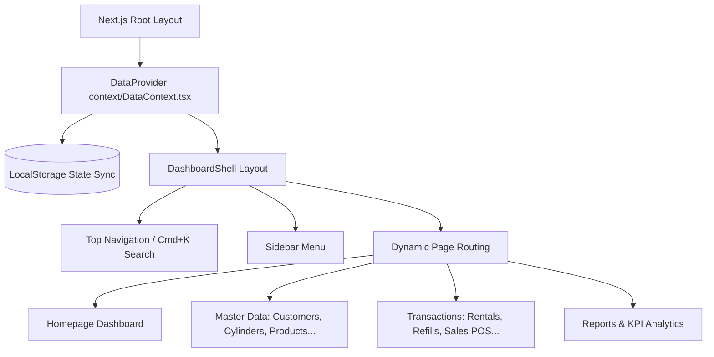
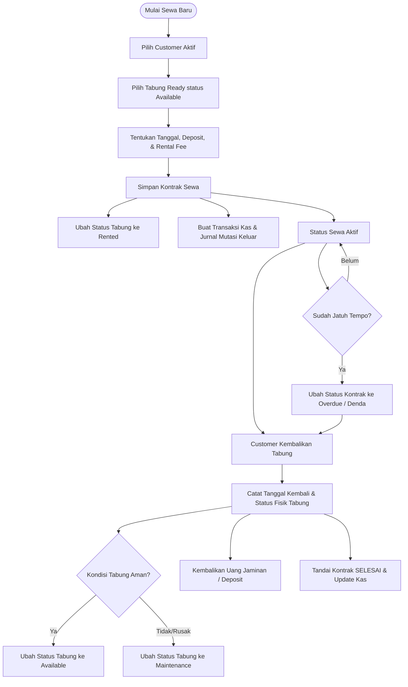
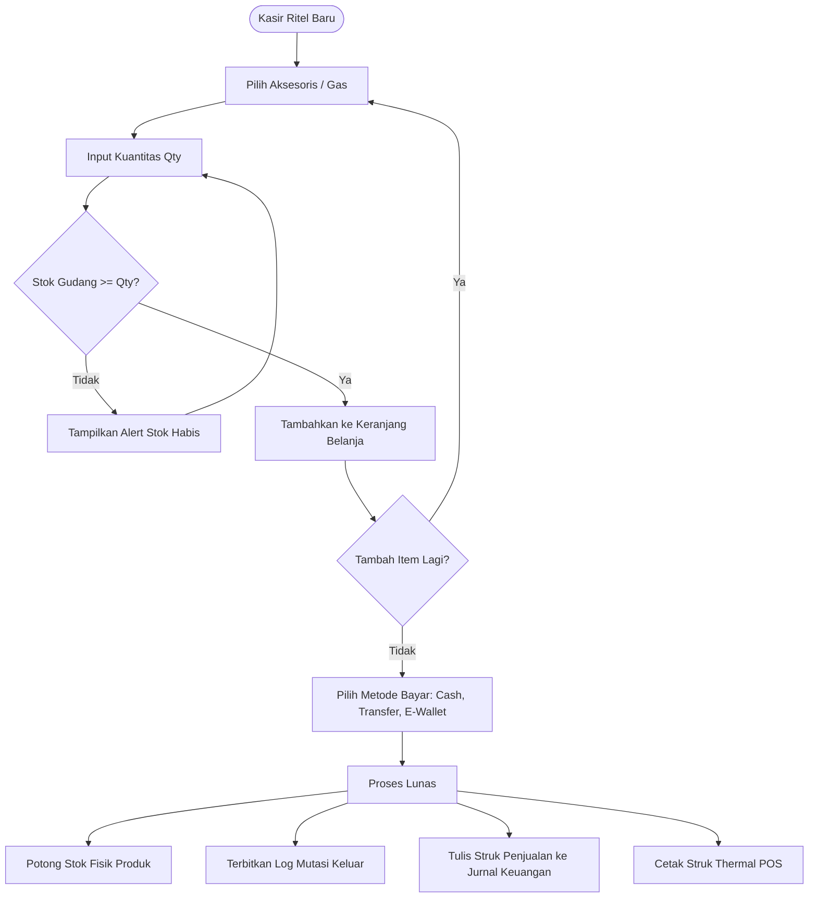
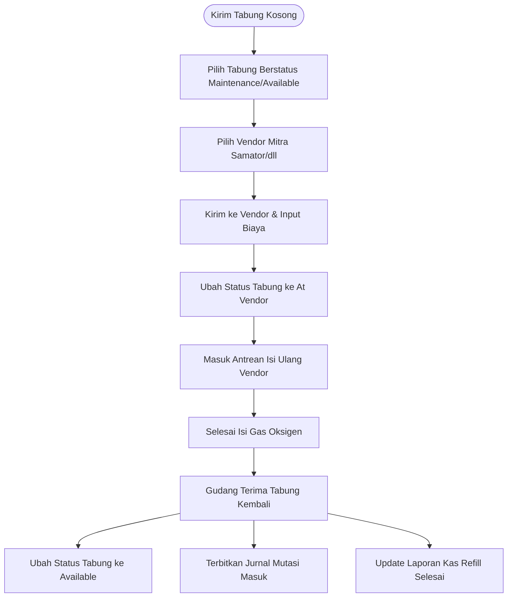

# Dokumentasi Sistem ERP Oksigen24Medis Dashboard

Selamat datang di repositori **Oksigen24Medis ERP Dashboard**, sebuah dashboard ERP modern berstandar industri khusus untuk manajemen persewaan tabung oksigen, isi ulang (refill) gas mitra, penjualan retail aksesoris medis, serta pelacakan logistik pergudangan.

Aplikasi ini dibangun menggunakan arsitektur **Next.js 16 (App Router)**, **React 19**, **TailwindCSS v4**, **TypeScript**, dan didukung oleh micro-animation dari **Framer Motion**.

---

## 🛠️ Arsitektur State & Integrasi Backend API

Sistem ini telah terintegrasi secara penuh dengan NestJS backend API dan PostgreSQL database untuk sinkronisasi data yang persisten secara real-time. Jika token autentikasi tersedia, sistem akan:

1. **Sinkronisasi State Global (`useData`)**:
   Mengambil data master dan transaksi secara langsung dari API backend (seperti `/inventory/customers`, `/transactions/rentals`, dll.) dan mengaturnya di dalam berkas `context/DataContext.tsx`.
2. **Real-time Event Synchronization (WebSockets)**:
   Menerima sinyal perubahan database dari backend melalui koneksi WebSocket Gateway aktif untuk merefresh data secara otomatis tanpa reload halaman.
3. **Backup Caching & Offline Mocking**:
   Menggunakan `localStorage` sebagai cache data ERP untuk render instan saat awal memuat aplikasi, serta berkas `context/mockData.ts` sebagai generator data statis (mock data) cadangan.

---

## 🗺️ Arsitektur & Diagram Alur (Mermaid)

### 1. Struktur Arsitektur Sistem ERP (React Context & State Flow)
Diagram ini menjelaskan bagaimana `DataProvider` bertindak sebagai *Single Source of Truth* yang mengelola state data secara reaktif dan mensinkronisasikannya dengan `localStorage`.



### 2. Alur Kerja Kontrak Penyewaan Tabung (Rental Lifecycle)
Menjelaskan proses sewa dari inisiasi kontrak, deposit jaminan, jatuh tempo keterlambatan (*overdue*), hingga pengembalian fisik tabung ke gudang.



### 3. Alur Kerja POS Kasir Penjualan Retail (Sales POS Cart Validation)
Siklus kasir ritel aksesoris dengan validasi sisa stok gudang secara real-time.



### 4. Siklus Hidup Isi Ulang Tabung Gas Oksigen (Cylinder Refills Loop)
Prosedur penanganan tabung kosong, antrean vendor gas industri, dan pengisian kembali gas oksigen siap sewa.



---

## 📋 Penjelasan Detail Fitur & Kompleksitas Alur Kerja

### 1. Dashboard Utama (Homepage - `app/page.tsx`)
Pusat kontrol operasional yang menyajikan rangkuman cepat kondisi bisnis:
- **Greeting Kontekstual**: Menyapa pengguna dinamis sesuai waktu hari (Pagi/Siang/Sore/Malam).
- **Statistik Ringkasan KPI**: 
  - **Pendapatan Hari Ini & Bulan Ini**: Mengkalkulasi omset gabungan dari rental lunas dan struk kasir ritel dengan tren kenaikan persen dibanding periode lalu.
  - **Rental Aktif**: Jumlah tabung oksigen yang saat ini berada di tangan pelanggan.
  - **Tabung Tersedia**: Total tabung berstatus *Available* (siap disewa) di gudang.
- **Pintasan Aksi Cepat (Quick Action Drawers)**: 
  - Tombol aksi instan untuk membuka Drawer (Formulir Geser Kanan) seperti *Sewa Baru*, *Kirim Refill*, *Kasir Ritel*, dan *Catat Kas Keluar* langsung dari halaman utama tanpa berpindah menu.
- **Grafik Tren Visual**:
  - *Area Chart* untuk melacak tren omset pendapatan 6 bulan terakhir.
  - *Donut Chart* untuk mengamati presentase alokasi status tabung oksigen secara real-time.
- **Ledger & Logistik Log**: Menampilkan 5 transaksi kasir terbaru dan 4 mutasi pergerakan stok gudang terakhir.

### 2. Modul Master Data (Manajemen Katalog & Aset)
Setiap halaman master data dilengkapi kontrol canggih: pencarian instan (real-time search), filter status keaktifan, pengurutan kolom tabel (sorting), paginasi halaman (pagination), drawer tambah/edit data, serta modal konfirmasi hapus data.

- **Manajemen Customer (`app/customers/page.tsx`)**:
  Melacak profil pelanggan instansi (Rumah Sakit, Puskesmas, Klinik) dan pasien mandiri rawat jalan. Menyimpan data kontak, email, alamat pengiriman tabung, joined date, serta status keaktifan pelanggan.
- **Manajemen Vendor (`app/vendors/page.tsx`)**:
  Kelola data mitra distributor dan pabrik pengisian gas oksigen. Mencatat nama perwakilan (PIC), nomor kontak, email, alamat pabrik, serta status jalinan kemitraan aktif/non-aktif.
- **Katalog Produk (`app/products/page.tsx`)**:
  Kelola katalog barang retail di luar persewaan tabung gas utama. Mengategorikan barang menjadi *Gas*, *Equipment* (alat medis), atau *Accessory* (aksesoris/consumables). Sistem melacak modal beli (cost) vs harga jual (price), serta memancarkan alert khusus (badge merah) apabila stok barang di gudang tersisa di bawah 10 unit.
- **Inventaris Tabung Oksigen (`app/cylinders/page.tsx`)**:
  Pelacakan aset tabung baja individu secara mendalam. Setiap tabung diidentifikasi berdasarkan **Serial Number (SN)**, ukuran volume tabung (`1m3`, `2m3`, `6m3`), tipe grade gas, tanggal uji kelayakan hydrotest/inspeksi terakhir, serta status lokasi tabung:
  - `Available` (Tersedia di gudang, siap disewa).
  - `Rented` (Berada di rumah/lokasi pelanggan).
  - `At Vendor` (Sedang dikirim/antre di pabrik isi ulang).
  - `Maintenance` (Sedang diuji kelayakan tekan atau servis valve).
- **Tipe Kandungan Gas (`app/oxygen-types/page.tsx`)**:
  Definisikan spesifikasi kemurnian oksigen dan sertifikasinya. Sistem membagi grade gas menjadi *Medical Oxygen* (purity 99.5% untuk medis), *Industrial Oxygen* (purity 99.2% untuk las/pabrik), dan *High-Purity Oxygen* (purity 99.99% untuk laboratorium). Halaman ini menghitung otomatis jumlah tabung gas aktif di gudang berdasarkan tipe grade gas tersebut.

### 3. Modul Alur Kerja Transaksi & Logistik Pergudangan

#### A. Penyewaan Tabung Oksigen (Oxygen Rentals - `app/rentals/page.tsx`)
Mengelola seluruh siklus penyewaan tabung oksigen dari pemesanan hingga pengembalian:
- **Formulir Kontrak Baru**: Memilih pelanggan aktif, memilih tabung baja kosong/tersedia, menentukan tanggal sewa & tanggal batas pengembalian (due date), nominal jaminan (deposit), serta biaya sewa.
- **Timeline Kontrak Fisik**: Visualisasi langkah demi langkah proses sewa (Kontrak Disetujui -> Jaminan Diterima -> Tabung Dibawa Pelanggan -> Tabung Kembali ke Gudang).
- **Pratinjau Invoice Digital**: Rincian tagihan berdesain profesional lengkap dengan kop PT Oksigen 24 Medika, rincian biaya sewa dan uang jaminan, kalkulasi total bayar, serta syarat & ketentuan legalitas sewa.
- **Workflow Pengembalian Tabung**: Saat pelanggan mengembalikan tabung, staf gudang dapat memilih tanggal aktual kembali dan memilah kondisi tabung pasca-sewa. Jika valve rusak, tabung langsung diarahkan ke status *Maintenance*, jika aman dikembalikan ke status *Available* (stok bertambah reaktif).

#### B. Pengisian Gas Vendor (Vendor Refills - `app/refills/page.tsx`)
Mengelola antrean tabung kosong yang dikirim ke pabrik pengisian ulang:
- **Pengiriman Tabung (Dispatch)**: Mengidentifikasi tabung kosong di gudang (status *Maintenance* atau *Available* kosong) untuk dikirim ke vendor tertentu dengan biaya pengisian per tabung. Status tabung otomatis berubah menjadi *At Vendor*.
- **Pantauan Antrean Vendor**: Memantau tabung yang sedang dalam antrean pengisian di pabrik mitra.
- **Penerimaan Tabung Isi (Receive)**: Staf gudang mencatat tanggal masuk tabung isi gas yang dikembalikan dari vendor. Status tabung otomatis kembali menjadi *Available* dan gas dinyatakan siap pakai.

#### C. Mutasi Stok Gudang (Stock Movement - `app/stock-movements/page.tsx`)
Audit ledger pergudangan yang merekam riwayat perpindahan barang secara transparan:
- **Pencatatan Otomatis**: Setiap transaksi penjualan kasir (stok produk berkurang), restock supplier (stok produk bertambah), dan peminjaman/pengembalian rental otomatis menulis log mutasi barang.
- **Koreksi Stok Opname Manual (Adjustment)**: Mengakomodasi kebutuhan audit fisik jika ditemukan selisih barang di gudang. Staf gudang dapat memilih produk, memasukkan jumlah selisih (+/-), menentukan alasan koreksi (misal: "Barang pecah/rusak di rak"), dan stok katalog produk langsung terupdate secara real-time.

#### D. Pengadaan Stok Supplier (Purchases - `app/purchases/page.tsx`)
Pembelian grosir untuk mengisi kembali persediaan aksesoris medis:
- **Supplier Shopping Cart**: Menyediakan antarmuka keranjang belanja dinamis di dalam drawer. Pengguna memilih supplier, memilih produk restock, memasukkan kuantitas beli, dan sistem menghitung estimasi pengeluaran kas.
- **Restock Otomatis**: Saat transaksi disubmit, stok produk bersangkutan di gudang langsung bertambah secara reaktif, dan transaksi kas keluar terdaftar otomatis di jurnal pengeluaran.

#### E. Kasir Kas Ritel (Sales POS - `app/sales/page.tsx`)
Kasir Point of Sales (POS) terintegrasi untuk pelanggan walk-in:
- **Validasi Stok Real-Time**: Kasir tidak dapat memproses penjualan melampaui sisa stok fisik di gudang untuk mencegah *back-order* yang tidak disengaja.
- **Keranjang Belanja POS**: Mengatur daftar belanjaan ritel pelanggan, metode pembayaran (Cash, Transfer Bank, E-Wallet), dan menghitung total harga jual.
- **Thermal Receipt Printer Preview**: Menampilkan pratinjau struk thermal kasir berdesain minimalis yang siap dicetak ke printer kertas kasir.

#### F. Kas Pengeluaran (Expenses - `app/expenses/page.tsx`)
Jurnal pengeluaran dana operasional kantor:
- **Kategori Pengeluaran**: Pengelompokan pengeluaran kas seperti Operasional, Listrik/Utilitas, Sewa Cabang, Biaya Refill Vendor, Marketing, Gaji Karyawan, dan Lain-lain.
- **File Uploader Kwitansi**: Menyediakan komponen unggah file untuk menyematkan bukti nota/kwitansi fisik dalam format gambar/PDF.
- **Approval Status**: Mensimulasikan persetujuan keuangan. Jika pengeluaran kas bernilai besar, staf Keuangan dapat menginputnya sebagai *Pending*, dan pimpinan dapat menyetujui pengeluaran tersebut melalui tombol *Approve* sekali klik pada detail pengeluaran.

### 4. Modul Pelaporan & Executive Analytics
Menyediakan visibilitas performa bisnis jangka panjang bagi pemilik perusahaan (Owner):

- **Reports Hub (`app/reports/page.tsx`)**:
  - Menyediakan filter tanggal terpadu (`Start Date` s.d. `End Date`) dan filter periode lapor (Harian, Bulanan, Tahunan).
  - Terdiri dari 4 jenis laporan khusus:
    1. **Laporan Pendapatan**: Melacak omset dari rental & ritel dengan porsi persentase kontribusi masing-masing.
    2. **Laporan Sewa Tabung**: Rasio pengembalian tabung sewa dan grafik batang distribusi sewa berdasarkan ukuran tabung (1m³, 2m³, 6m³).
    3. **Laporan Pengeluaran**: Grafik lingkaran (*Donut Chart*) sebaran alokasi dana operasional per kategori.
    4. **Laporan Inventaris**: Menampilkan grafik total aset tabung berdasarkan pembagian lokasi fisiknya.
- **Analytics Executive KPI (`app/analytics/page.tsx`)**:
  Menganalisis margin keuntungan operasional bulanan (Revenue vs Net Profit), volume penjualan aksesoris medis terlaris, papan peringkat pelanggan penyumbang kontribusi omset tertinggi (Top Customers), serta performa vendor refill tercepat (Top Vendors).

### 5. Pengaturan ERP Sistem (Settings - `app/settings/page.tsx`)
- **Profil Perusahaan**: Ubah identitas legalitas (Nama PT, Email, WhatsApp Hotline, NPWP, Alamat Kantor Pusat).
- **Pengguna & Hak Akses**: Daftar akun staf aktif dan **Matriks Izin Operasi Modul** berdasarkan peran kerja karyawan (Owner, Admin, Finance, Warehouse Staff).
- **Notifikasi Triggers**: Saklar pintas WhatsApp tagihan otomatis dan email warning stok minim.
- **Tema Tampilan**: Switcher visual Light Mode (warna bersih beraksen Slate) dan Dark Mode (warna gelap premium beraksen Emerald) yang terhubung langsung ke DOM HTML.

---

## 🔍 Fitur Tambahan: Pintasan Global Command Palette (Cmd+K)

Pengguna dapat menekan kombinasi tombol `Cmd+K` (macOS) atau `Ctrl+K` (Windows/Linux) kapan saja untuk memicu Modal Pencarian Pintas Global:
- Memungkinkan pencarian instan ke seluruh database lokal (Cari Pelanggan, cari Vendor, cari Serial Number Tabung Oksigen, atau cari Katalog Produk).
- Klik pada hasil pencarian otomatis menutup modal dan mengarahkan rute halaman ke modul yang dituju, lengkap dengan penulisan query parameter pencarian instan pada tabel tujuan.
- Menyediakan tombol navigasi cepat ke antrean isi ulang, kasir POS, pengembalian rental, dan pencatatan biaya operasional.

## 🛠️ Pembaruan Integrasi Backend & Fitur Terkini

Sistem dashboard ERP ini telah disesuaikan agar berjalan selaras dengan pembaruan backend dan database terbaru:

1. **Pembaruan Aset & Pendaftaran Vendor**:
   * **Penghapusan Kolom Email Vendor**: Pendaftaran dan pembaruan data vendor (Supplier) kini tidak lagi mengirimkan atau memerlukan alamat email ke backend API, sejalan dengan penghapusan kolom tersebut pada database backend.
   * **Pembersihan Data Aset**: Data tabung sirkulasi fisik (seperti `CYL-1M3`, `CYL-6M3`) kini dikelola secara eksklusif dalam database tabel `cylinders` dan tidak dicampur ke tabel produk retail `products`.
2. **Kalkulasi & Breakdown Distribusi Sewa**:
   * Halaman utama (Dashboard) dan halaman laporan (Reports Hub) kini menyajikan sub-kalkulasi visual reaktif mengenai sebaran jenis aset sewa aktif:
     * **Tabung Besar**: Tabung sewa aktif berukuran `6m3`.
     * **Tabung Kecil**: Tabung sewa aktif berukuran selain `6m3`/`PCS` dan serial number tidak diawali `REG-`, `TRL-`, `ACC-`.
     * **Regulator / Aksesoris**: Regulator sewa aktif diawali SN `REG-` atau berukuran `PCS`.
3. **Override Manual Biaya Sewa (`totalAmount`)**:
   * API client pada drawer kontrak sewa baru telah disesuaikan untuk mengirimkan properti `totalAmount` (berdasarkan input biaya sewa manual dari pengguna) ke backend API `/transactions/rentals`, sehingga backend dapat menyimpan nilai harga sewa kustom tersebut secara persisten.
4. **Fungsionalitas Filter & Tabel Rekapitulasi Pendapatan**:
   * **Preset Rentang Tanggal Otomatis**: Memilih periode laporan (Harian, Bulanan, Tahunan) otomatis memperbarui tanggal mulai dan tanggal selesai dengan preset default (Harian: 7 hari terakhir, Bulanan: 30 hari terakhir, Tahunan: tahun berjalan kalender 1 Jan - 31 Des).
   * **Tabel Rekapitulasi Dinamis**: Menampilkan tabel pratinjau yang menyesuaikan dengan periode pilihan:
     * **Harian (Daily)**: Menampilkan detail transaksi per transaksi kasir.
     * **Bulanan (Monthly)**: Menampilkan ringkasan aggregate harian (jumlah transaksi, tipe layanan, sum cash/transfer/qris/total).
     * **Tahunan (Yearly)**: Menampilkan ringkasan aggregate bulanan (nama bulan, jumlah transaksi, tipe layanan, sum cash/transfer/qris/total).
   * **Visualisasi Chart Dinamis**: Menyajikan chart tren pendapatan yang terformat dinamis sesuai periode yang dipilih (menampilkan baris harian pada opsi Harian, dan visual bulanan Jan-Des pada opsi Tahunan).
   * **Fix Timezone Offset**: Memperbaiki bug pergeseran zona waktu pada penarikan tren pendapatan bulanan yang sebelumnya menyebabkan grafik terlihat flat 0.

---

## 🛠️ Langkah Menjalankan Project

1. Pastikan Anda telah memasang [Node.js](https://nodejs.org/).
2. Jalankan perintah instalasi dependensi di terminal:
   ```bash
   npm install
   ```
3. Jalankan server pembangunan lokal:
   ```bash
   npm run dev
   ```
4. Buka alamat [http://localhost:3000](http://localhost:3000) pada peramban web Anda untuk menjelajah dashboard ERP Oksigen24Medis secara interaktif.
5. Untuk memverifikasi kesiapan kompilasi produksi (production build):
   ```bash
   npm run build
   ```
